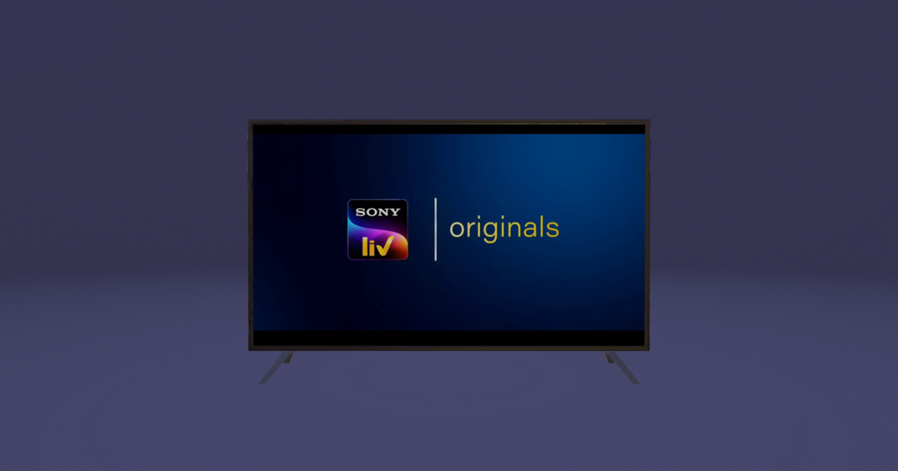

# 3D TV & VideoTexture



## About The Project

This is a demo of a 3D TV with a video playing on it. The video is a [VideoTexture](https://doc.babylonjs.com/divingDeeper/materials/textures/videoTexture)

### [Live Demo](https://3-d-tv-video-texture.vercel.app/) 👀

### Built With

- [Vite](https://vitejs.dev/)
- [Babylon.js](https://www.babylonjs.com/)
- [TypeScript](https://www.typescriptlang.org/)
- [Sass](https://sass-lang.com/)
- [Prettier](https://prettier.io/)
- [ESLint](https://eslint.org/)
- [Blender](https://www.blender.org/)

## Getting Started

### Prerequisites

- [Node.js](https://nodejs.org/en/) (>= 20.10.0)

### Installation

Clone the project and install dependencies with `npm install` (or `pnpm install` or `yarn`).

### Developing

Start a development server:

```bash
npm run dev

# or start the server and open the app in a new browser tab
npm run dev -- --open
```

### Building

To create a production version of the app, run the following command.
This will create an optimized build of the app in the `dist` folder.

```bash
npm run build
```

You can preview the production build with `npm run preview`.

## Roadmap

- (optional) Change the default engine to WebGPU and add a fallback to WebGL

## License

The names of actual companies and products mentioned herein may be the trademarks of their respective owners. Except where otherwise noted, the content provided in this repository is licensed under a [Attribution-NonCommercial 4.0 International](https://creativecommons.org/licenses/by-nc/4.0/deed.en), and code samples are licensed under the [MIT license](https://opensource.org/licenses/MIT).
